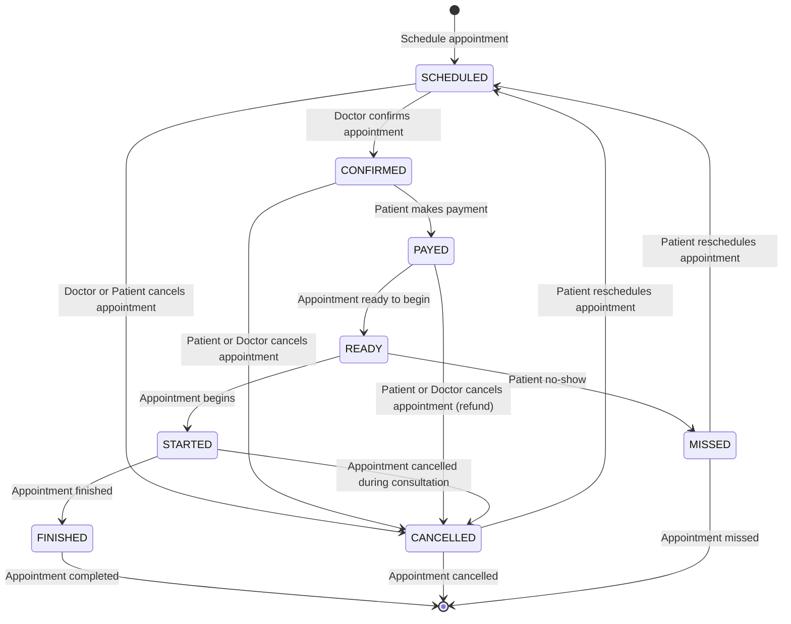

# Life Cycle Diagram

The following diagram shows the life cycle of a medical appointment in the system. The life cycle begins with the creation of a scheduled appointment and ends with the completion of the appointment. The diagram shows the different statuses that an appointment can go through and the transitions between these statuses.

